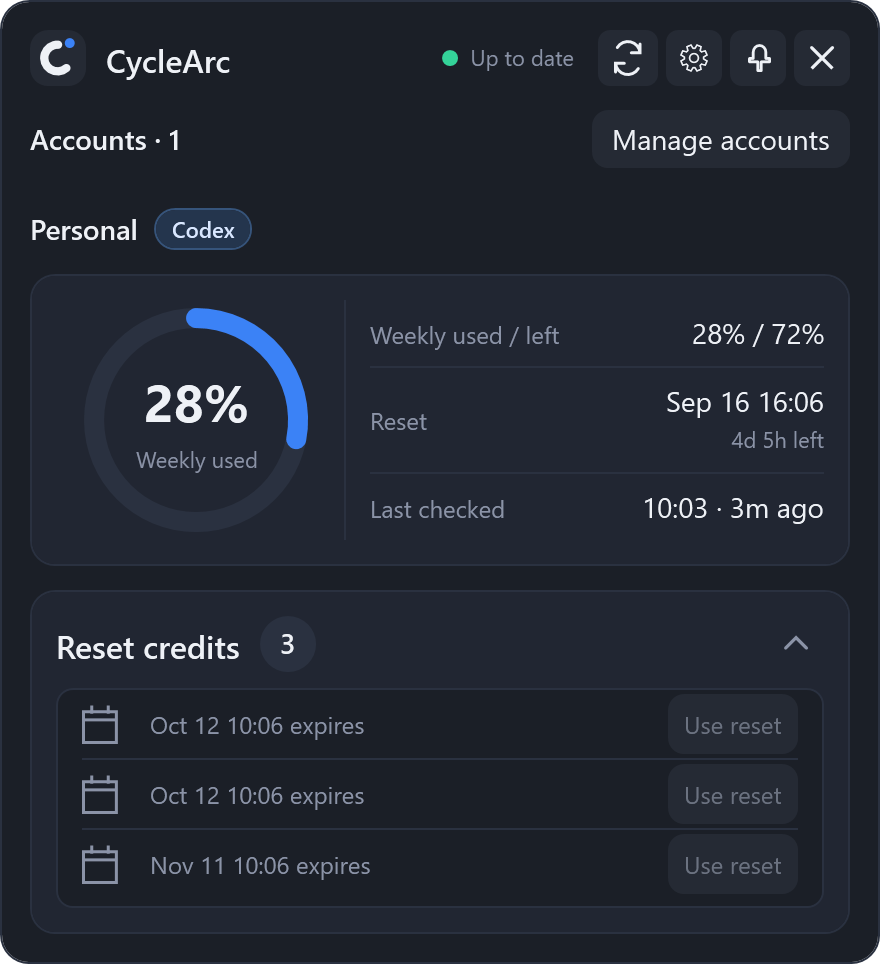
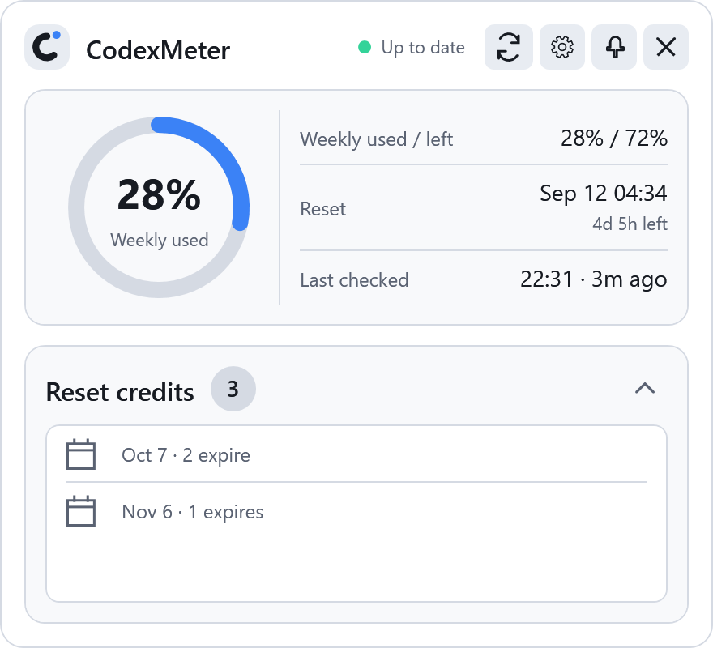
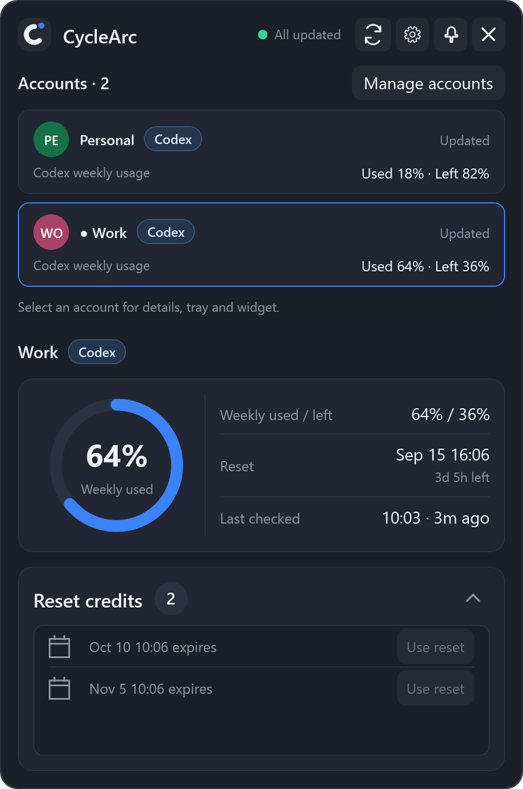
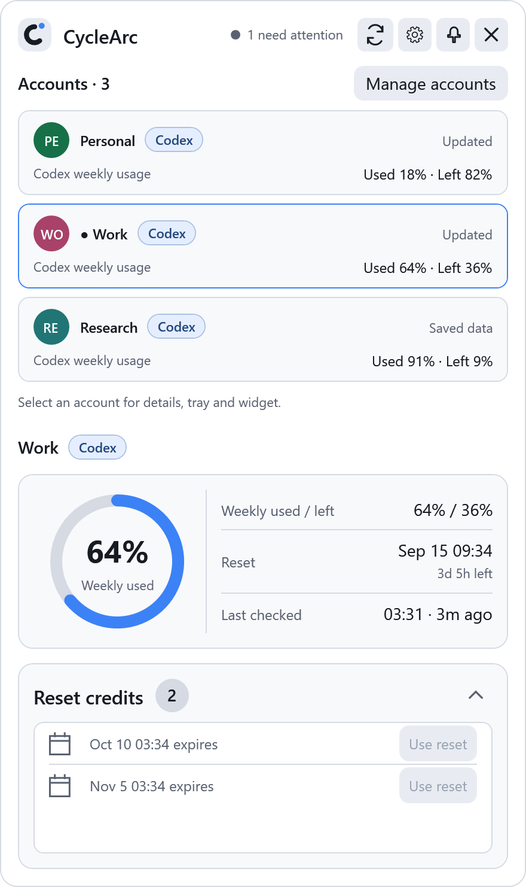
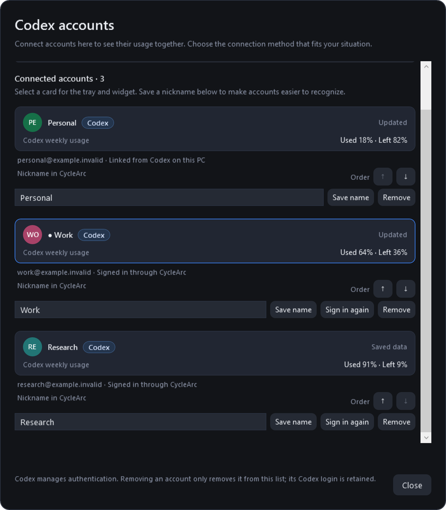
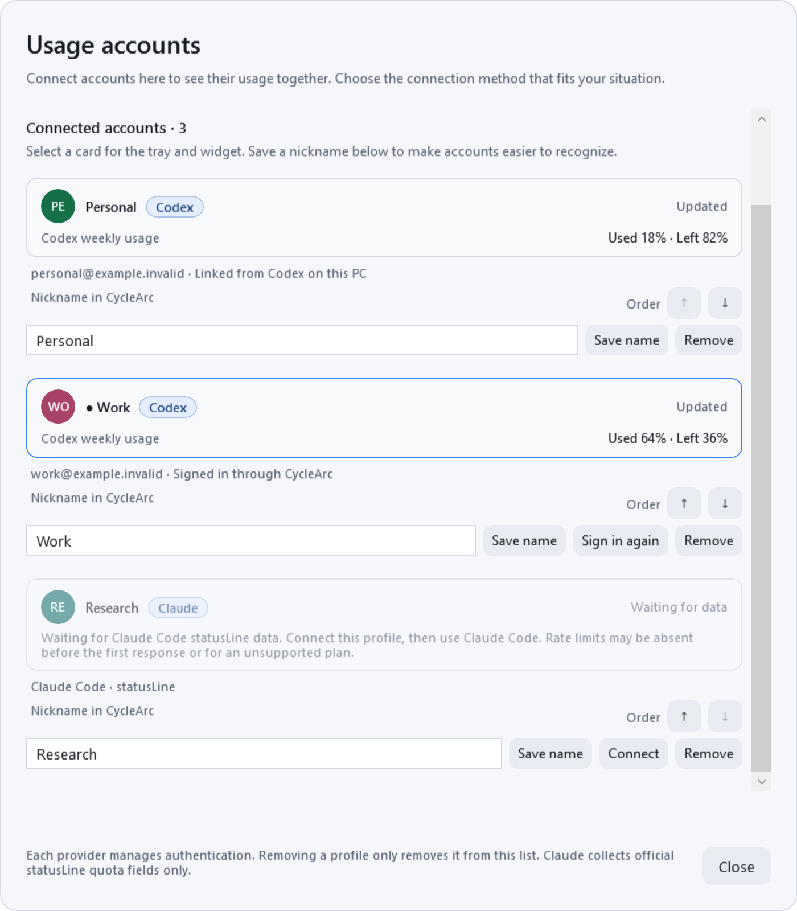
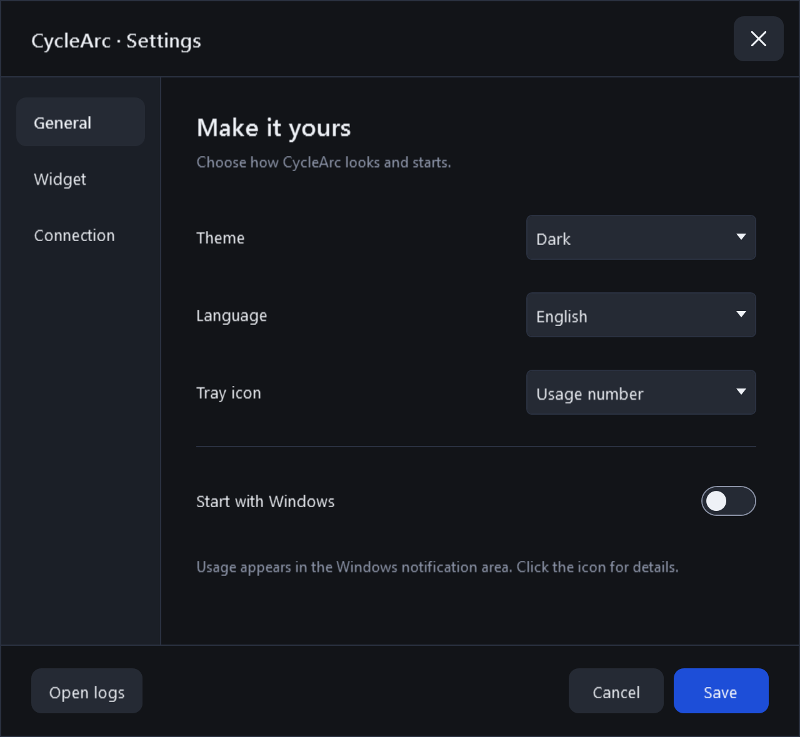

# CycleArc

**Your Codex and Claude limits, one click away.**

A native Windows tray app for checking multiple Codex and Claude profiles, remaining percentages and reset times. Codex accounts also show reset credits when available.

Formerly **CodexMeter**. The **Codex** or **Claude** badge on account cards, selected details, tray tooltips and the widget identifies the usage provider. Claude Code supplies usage through its official **statusLine JSON**; see [Claude Code connection](#claude-code-connection). Gemini is not supported.

> **Codex:** ChatGPT Pro subscriptions are supported; the ChatGPT Plus five-hour usage limit is not supported. **Claude:** the official statusLine must supply the requested rate-limit fields; these can be absent before the first response or on unsupported plans.

[](https://github.com/frozenvoice/cyclearc/actions/workflows/windows.yml)
[](LICENSE)
[](#get-started)

[Download for Windows](https://github.com/frozenvoice/cyclearc/releases/latest) · [Multi-account examples](#accounts) · [한국어](docs/README.ko.md) · [Report an issue](https://github.com/frozenvoice/cyclearc/issues)

<table>
  <tr>
    <td align="center"><strong>Dark</strong></td>
    <td align="center"><strong>Light</strong></td>
  </tr>
  <tr>
    <td></td>
    <td></td>
  </tr>
</table>

*English previews rendered from the production WPF views using sample quota data. Available windows and reset-credit details depend on what your account reports.*

## At a glance

- **Multiple accounts together.** Link an existing Codex sign-in or add accounts through the official browser login. See every account's usage in one popup and choose which account appears in the tray and widget.
- **Usage in the tray.** A Windows notification-area icon keeps the meter within reach. Click for the detailed card; pin it to keep it visible.
- **Clear quota windows.** See Pro account usage and remaining percentages, the server's reset time, and a countdown for the windows reported by the server.
- **Reset credits.** View the available count and expiry times when the server supplies them. Use an individual reset after confirmation. Missing expiry information stays explicitly unknown.
- **Optional desktop widget.** A compact, draggable meter with adjustable opacity, always-on-top, and click-through options. Off-screen positions recover automatically.
- **Your preferred appearance.** Dark, Light, or live System theme; English and Korean; keyboard zoom from 80% to 150%.
- **Honest refresh states.** Automatic checks at a selectable 1, 2, 5, 10, 30 or 60-minute interval (default: five minutes), visible manual-refresh progress, and distinct fresh, stale, signed-out, and unavailable states.

## Get started

**Requirements:** Windows 10/11 on x64. Codex monitoring requires an installed Codex CLI, a ChatGPT Pro subscription and network access. Claude monitoring requires Claude Code with official statusLine rate-limit support and Windows PowerShell; it does not require Codex sign-in.

1. Download the executable from the [latest release](https://github.com/frozenvoice/cyclearc/releases/latest). Current source builds produce **`CycleArc.exe`**; releases from before the rename use `CodexMeter.exe`.
2. Put it in a folder you want to keep and run it. The .NET runtime is bundled; there is no separate runtime installer.
3. Open the tray icon. Existing Codex sign-ins are discovered automatically. To add another account, choose **Manage accounts → Add an account · Connection guide → New account sign-in** and complete the official login in your browser.
4. If Codex cannot be found, install the [Codex CLI](https://developers.openai.com/codex/cli/) or open **Settings → Connection** and select its executable path.

CycleArc discovers `codex.exe` or `codex.cmd` through PATH and supported installation locations. The Codex CLI itself is not bundled. Sign-in remains managed by Codex.

### Accounts

**Manage accounts** is available in the popup and **Settings → Connection**. The connection guide explains new browser login, linking a Codex login on this PC, and advanced folder selection. The guide opens automatically when there is no previously checked account; existing users see their account list first. All accounts retain separate percentages, reset windows, credit actions and refresh states; values are never added together.

<table>
  <tr>
    <td align="center"><strong>Three accounts · Dark</strong></td>
    <td align="center"><strong>Three accounts · Light</strong></td>
  </tr>
  <tr>
    <td></td>
    <td></td>
  </tr>
</table>

*These are production UI renders with entirely fictional accounts and quota data, not captures of a user's account. Names, `example.invalid` email addresses, percentages, reset times and credits are samples.*

Read the example from the account list down to the detail card:

1. **Compare accounts separately.** Personal has used 18%, Work 64%, and Research 91% of their own weekly windows. These percentages are not combined into one allowance.
2. **Choose the detail account.** The blue border and dot mark Work as selected, so the ring shows Work's **64% used**, with **36% left** in the quota row. The reset-credit card also belongs to Work. Clicking another account changes the detail card, tray and widget; it does not switch the login used by your other Codex apps or start a refresh.
3. **Check freshness.** Research is marked **Saved data**: its 91% is a previous successful reading, not a newly confirmed value. The other accounts can still show current data. The header counts Research as one account needing attention.

To connect an account, choose the option that matches your setup:

| Your situation | Choose | What happens |
| --- | --- | --- |
| First use, or adding another email account | **Add an account · Connection guide → New account sign-in** | Complete the official browser login for that account; CycleArc checks its usage and keeps its Codex home separate. |
| Already signed into Codex CLI on this PC | **Find accounts on this PC** | Connect the existing login from a known Codex home. A ChatGPT website-only login is not enough. |
| Already use a custom `CODEX_HOME` | **Advanced · Connect a specific Codex folder → Choose Codex home folder** | Select that home folder, not the Codex executable or a project folder. |

Set a **Nickname in CycleArc** to recognize an account; leaving it empty shows the email. The current official Codex account API supplies email/plan, not the ChatGPT website's nickname or profile picture. Circular icons are generated locally from the displayed name and a stable account color. They are not synced web avatars; saving a nickname does not change the ChatGPT profile. Expand **Nicknames, icons and account actions** for details.

Use **Order ↑ / ↓** beside each account's nickname to move it. The popup follows the same order, which is saved immediately and retained after restart. Reordering keeps the selected tray/widget account and does not initiate a quota refresh. Select a card to change which account drives the tray/widget. **Sign in again** changes the login for a profile added in CycleArc; **Remove** only forgets the profile from this list.

<details>
<summary><strong>Account manager · Dark preview</strong></summary>

<p>The account manager is scrolled down to show every sample account's nickname field, save action and order controls. The disabled first/last arrows show the list boundaries. Work stays selected while you arrange the list.</p>
<p></p>

</details>

<details>
<summary><strong>Account manager · Light preview</strong></summary>

<p></p>

</details>

**Find accounts on this PC** checks `CODEX_HOME` from the process/user/machine environment and the default `~/.codex` directory through `account/read`. It cannot discover an account signed in only on the ChatGPT website. **Advanced · Connect a specific Codex folder → Choose Codex home folder** connects another known home; choose the home, not the executable or a project folder. It does not search the disk for credentials or copy an existing login. Imported homes stay linked to their original Codex installation; reauthenticate those in Codex itself.

New profiles receive separate homes under `%LOCALAPPDATA%\ProMeter\accounts\<local-id>\codex-home`. Only the installed Codex process stores and renews credentials there. Browser sign-in has a five-minute deadline and can be cancelled. Choose the intended email account in the browser; if two profiles report the same email and plan, both display a matching-login notice. The protocol does not expose a stable workspace identifier, so that notice does not establish whether workspaces are identical.

Removing a profile forgets its reference without logging out or deleting its Codex home. It will not be automatically re-added. A custom home can be connected again with the folder picker.

The first launch opens the detail card. Later launches start in the tray; `CycleArc.exe --show` opens the card at startup. If Windows hides the tray icon, move it out of the notification-area overflow. Starting with Windows and showing the desktop widget are optional settings.

### Claude Code connection

1. Open **Manage accounts → Add an account · Connection guide → Add Claude profile**. Set an optional nickname using the same rules as Codex accounts.
2. In the connection window, choose **Copy statusLine settings** and merge the `statusLine` entry into the Claude Code settings used for that account. Keep unrelated settings. If you already have a statusLine, retain it in a wrapper that passes the same stdin to both commands; [integration details](docs/CLAUDE.md) include an example.
3. Use Claude Code and complete a response. CycleArc receives only `rate_limits.five_hour` / `rate_limits.seven_day` → `used_percentage` and `resets_at`. Each window may be absent independently. Unknown data is never displayed as zero.

The official JSON has **no account email or account ID**. A Claude profile is a local binding to its generated command, not a verified account identity. Configure a separate profile/command for each Claude account, and change the command when switching accounts. A nickname takes precedence; without a nickname, Claude shows `Claude · <local profile ID>` while Codex retains its reported-email fallback. Account selection, order and aliases share the existing UI; profiles are never added together.

The last valid sample becomes **stale after five minutes without valid statusLine input**, when its reported reset time passes, or after missing/malformed input. Stale values survive restarts. Manual refresh and the passive inbox poll do not renew the sample's receipt time, query Claude, or synthesize a new quota period. The detail card shows **Last received**. Claude has no Codex reset-credit controls.

Only the official statusLine input is used. CycleArc does not parse `/usage`, read Claude auth/token files, launch a model turn, inspect transcripts or call an undocumented usage endpoint. It saves projected quota fields and local receipt/status metadata, never the full JSON. See [the official statusLine documentation](https://code.claude.com/docs/en/statusline).

### Controls

| Action | Result |
| --- | --- |
| Click the tray icon | Open or hide the detail card |
| Refresh button | Check account limits immediately |
| Pin button | Keep the detail card on top |
| `Ctrl` + `+` / `Ctrl` + `-` | Enlarge or reduce the detail card |
| `Ctrl` + `0` | Restore 100% zoom |
| Drag the widget | Move it and save its position |
| Right-click the widget | Open its menu, including Close widget |

The zoom shortcuts also support the numeric keypad. Widget position can be reset from **Settings → Widget**; the reset takes effect when you save.

<details>
<summary><strong>Settings and compact widget</strong></summary>

<p></p>
<p></p>

</details>

## How it works

CycleArc starts a bounded, short-lived **Codex App Server** process per account and requests account/rate-limit metadata. Every UI entry point shares the same refresh batch, with at most two simultaneous reads. One interactive login may run alongside reads for other accounts. It does not run a model turn to measure usage.

Percentages come from the reported limit windows. CycleArc does **not** turn them into invented request counts or combine unrelated reset periods. When a refresh fails, the last valid snapshot may remain visible with a stale label. Opening the card immediately after a failed check does not trigger repeated automatic retries; manual refresh remains available. Claude uses an independent passive provider and receives stdin through a headless mode of the same executable. Its projected inbox is checked every two seconds without starting Codex or Claude.

Countdowns and “last checked” ages update locally once a minute without another server request.

### Privacy

- No prompt, response, conversation, project, or rollout collection.
- No direct reading or copying of Codex authentication files, tokens, browser cookies, or credentials.
- No external telemetry or analytics.
- Only local preferences, profile references/labels, projected quota metadata, and safe diagnostic logs are retained. Emails from the account protocol are kept in memory for display; quota caches bind to a hash of the reported identity. Authentication is handled by the installed Codex process.

Settings and quota cache remain under `%LOCALAPPDATA%\ProMeter` for upgrade compatibility. Settings use atomic replacement with a previous-good backup and recovery if the primary file is damaged.
The account registry (`codex-accounts.json`) also uses atomic writes and a previous-good backup. The original account continues using `codex-snapshot.json`; additional profiles have separate quota caches. Existing preferences and historical files are preserved.

CycleArc is an independent project and is not affiliated with or endorsed by OpenAI. Compatibility depends on the installed Codex App Server protocol and the metadata available to your account.

## Build from source

Requires Windows, PowerShell 7, and the .NET 8 SDK.

```powershell
git clone https://github.com/frozenvoice/cyclearc.git
cd cyclearc
.\dev-run.ps1
```

The launcher restores dependencies, builds Release, runs the tests and WPF checks, then publishes and launches **one self-contained `CycleArc.exe`**. It retries transient deployment locks and restores the previous local build if replacement or startup fails.

- `-NoLaunch`: validate the staged executable without replacing the running local app.
- `-Fast`: skip the unit suite only when it has already passed for the same changes.
- CI also publishes the single executable as the `CycleArc-win-x64` artifact.

| Path | Purpose |
| --- | --- |
| `src/CodexMeter` | Active WPF tray application |
| `src/CodexMeter.Core` | Quota protocol, presentation logic, persistence, and retained legacy logic |
| `tests/CodexMeter.Tests` | Unit and regression tests |
| `tests/CodexMeter.UiSmoke` | Production WPF layout checks and documentation previews |

See [Architecture](docs/ARCHITECTURE.md), [Validation](docs/VALIDATION.md), and [preview generation](docs/images/README.md) for implementation and verification details.

## Upgrading from CodexMeter or ProMeter

Run `CycleArc.exe` instead of `CodexMeter.exe` or `prometer.exe`. Existing preferences and quota-cache paths remain compatible. The former ChatGPT history reconstruction, browser companion, and WebView2 features are retired; old history data is neither read nor deleted by the active app. The old browser extension can be removed through your browser's extension manager.

Retained legacy source and tests are identified in the architecture document. The companion host and retired screens are excluded from the shipped executable.

## License

[MIT](LICENSE). Contributions and reproducible bug reports are welcome. Please omit account credentials and conversation content from issues and attachments.
