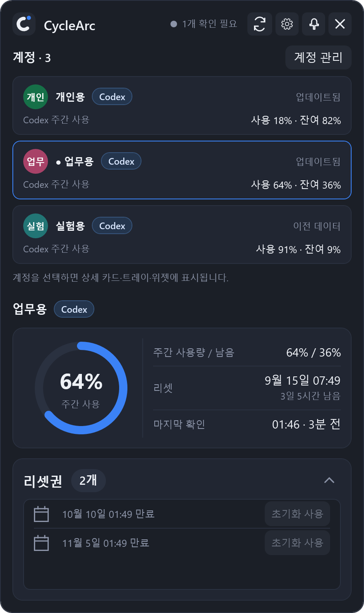
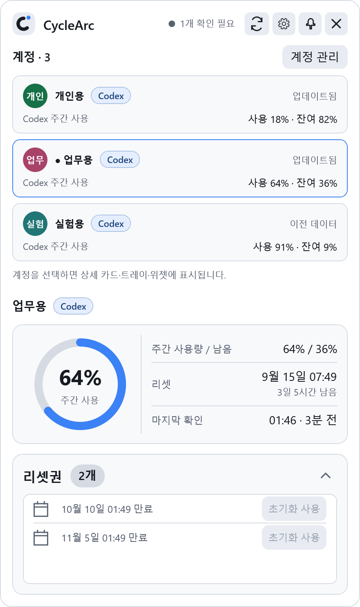
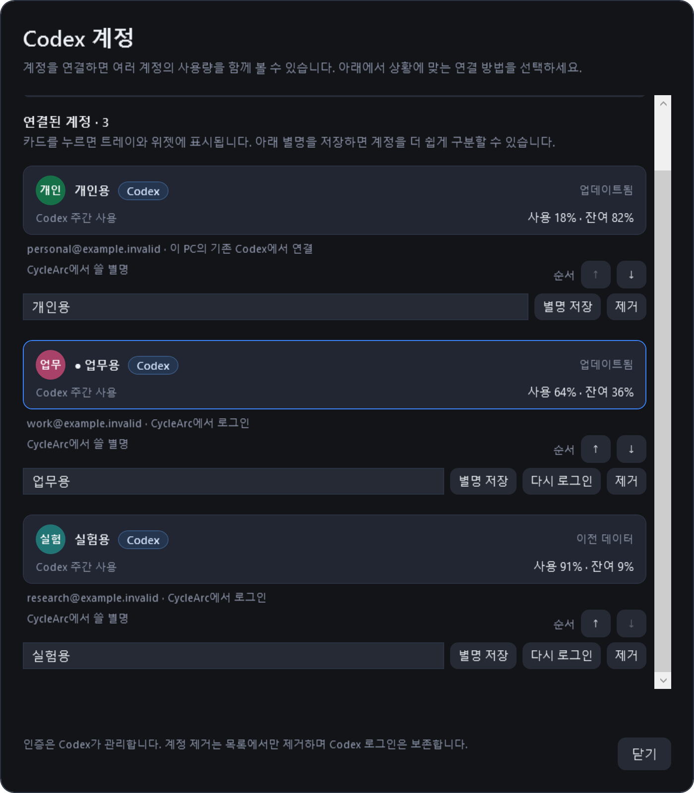
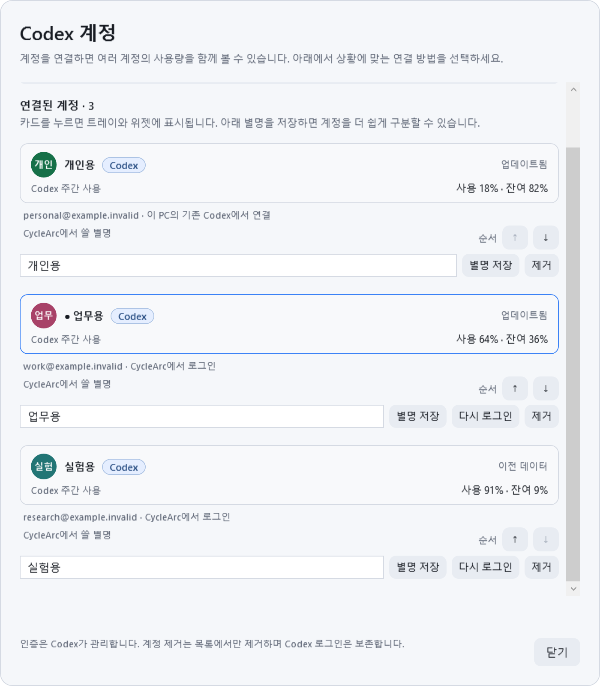

# CycleArc

[English](../README.md) · [다운로드](https://github.com/frozenvoice/codexmeter/releases/latest)

Windows 트레이에서 **여러 Codex 계정의 사용률, 남은 비율, 리셋 시각**을 함께 확인하는 앱입니다.

제품명이 **CodexMeter에서 CycleArc로 변경**되었습니다. 계정 카드·선택한 상세 화면·위젯의 **Codex 배지**는 어떤 AI의 사용량인지 표시합니다. **현재는 Codex만 지원**하며 Claude·Gemini 연동은 제공하지 않습니다. 기존 계정, 설정과 캐시는 그대로 사용합니다.

> **Pro 구독 전용입니다.** 현재 버전은 ChatGPT Pro 구독자의 Codex 사용량 모니터링을 지원합니다. **ChatGPT Plus 구독의 5시간 사용량은 지원하지 않습니다.**

ChatGPT Pro/Sol 기록 추정 기능은 종료했습니다. Edge/Chrome 확장, 별도의 ChatGPT 기록 접근,
대화 기록 동기화, SQLite 기록 집계, WebView2는 현재 앱에서 사용하지 않습니다.

## 다중 계정 미리 보기

<table>
  <tr>
    <td align="center"><strong>계정 3개 · 다크</strong></td>
    <td align="center"><strong>계정 3개 · 라이트</strong></td>
  </tr>
  <tr>
    <td></td>
    <td></td>
  </tr>
</table>

*실제 앱 화면에 가상 데이터만 넣어 만든 문서용 이미지입니다. 실제 사용자의 계정을 캡처하지 않았으며, 이름·`example.invalid` 이메일·사용률·리셋 시각·리셋권은 모두 예시입니다.*

화면은 위의 계정 목록부터 아래 상세 카드 순서로 읽으면 됩니다.

1. **계정별 사용량을 비교합니다.** 개인용 18%, 업무용 64%, 실험용 91%는 각각의 주간 한도에 대한 사용률입니다. 서로 다른 계정의 비율이나 리셋권을 합산하지 않습니다.
2. **자세히 볼 계정을 선택합니다.** 파란 테두리와 점이 있는 업무용이 현재 선택 계정입니다. 큰 링의 **사용 64%**, 오른쪽 행의 **남음 36%**, 아래 리셋권도 모두 업무용 계정의 정보입니다. 다른 카드를 누르면 상세 화면·트레이·위젯의 표시 계정이 바뀝니다. 이 선택으로 다른 Codex 앱의 로그인 계정이 바뀌거나 새로고침이 시작되지는 않습니다.
3. **데이터 상태를 확인합니다.** 실험용의 **이전 데이터** 표시는 현재 조회가 확인되지 않아 마지막 정상 조회 값인 91%를 보여준다는 뜻입니다. 다른 계정은 계속 최신 데이터를 표시할 수 있습니다. 상단의 **1개 확인 필요**도 이 계정의 상태를 가리킵니다.

## 실행

배포 파일은 **`CycleArc.exe` 하나**입니다. .NET 런타임이 포함되어 별도 .NET 설치가 필요 없습니다.

사용량 조회에는 이 PC에 설치된 **Codex CLI**와 네트워크 연결이 필요합니다. 로그인은 CycleArc에서 시작할 수 있습니다.
앱은 `codex.exe` 또는 `codex.cmd`를 PATH와 일반 설치 위치에서 찾습니다.
자동으로 찾지 못하면 트레이 메뉴 → 설정에서 실행 파일의 절대 경로를 지정하세요.
Codex CLI 자체는 이 배포 파일에 포함하지 않습니다.

## 계정 추가와 연결

팝업의 **계정 관리** 또는 **설정 → 연결 → Codex 계정 관리**를 여세요.

- **계정 추가 · 연결 방법 → 새 계정 로그인**: 처음 사용하거나 다른 계정을 추가할 때 선택하세요. 브라우저에서 사용할 ChatGPT 계정을 선택하고 돌아오면 사용량을 자동으로 확인합니다. 독립된 Codex 홈을 사용하므로 기존 Codex 로그인은 유지됩니다.
- **이 PC의 계정 찾기**: 이미 이 PC의 Codex CLI에 로그인한 계정을 연결합니다. 기본 `~/.codex`와 프로세스·사용자·시스템 `CODEX_HOME`을 공식 `account/read`로 확인하며 시작할 때도 자동으로 찾습니다. ChatGPT 웹에만 로그인한 계정은 대상이 아닙니다.
- **고급 · Codex 폴더 직접 연결**: `CODEX_HOME`을 별도로 지정해 사용하던 경우에만 필요합니다. Codex 홈 폴더를 선택하며 실행 파일이나 작업 프로젝트 폴더를 고르는 기능이 아닙니다. 디스크 전체를 검색하거나 인증 파일을 읽고 복사하지 않습니다.
- 계정 카드를 선택하면 기존 상세 링·리셋권 카드와 트레이·위젯이 해당 계정을 표시합니다. 모든 계정의 요약은 한 화면에 유지되며 계정 수에 2개 제한이 없습니다.
- **순서 ↑ / ↓**: 계정을 위·아래로 옮깁니다. 사용량 팝업에도 같은 순서가 적용되고 즉시 저장되어 재시작 후 유지됩니다. 표시 순서를 바꿔도 선택 계정은 그대로이며 새로고침을 시작하지 않습니다.
- **별명 저장**: CycleArc에서 표시할 이름을 정합니다. 비워서 저장하면 이메일을 표시합니다. 원형 아이콘은 이름의 앞 두 글자와 고정된 계정 색상으로 이 앱에서 만듭니다. 현재 공식 Codex 계정 API에는 ChatGPT 웹의 닉네임·프로필 사진이 없어 자동으로 가져오지 않습니다. 별명을 바꿔도 ChatGPT 프로필은 바뀌지 않습니다.
- **다시 로그인**: CycleArc에서 추가한 프로필의 로그인을 갱신하거나 변경합니다. 기존 Codex에서 연결한 프로필은 원래 Codex에서 다시 로그인하세요.
- **제거**: 목록에서 연결 정보만 잊으며 Codex 로그인·홈·사용량 캐시는 삭제하지 않습니다. 제거한 홈은 자동으로 다시 추가되지 않으며 폴더 선택으로 다시 연결할 수 있습니다.

**별명·아이콘과 버튼 사용 안내**를 펼치면 각 동작의 설명을 볼 수 있습니다. 정상 조회 이력이 없는 첫 사용에는 연결 방법이 자동으로 펼쳐지며, 이미 연결한 계정이 있으면 목록부터 표시합니다. 설명이 길어져도 본문 전체를 스크롤할 수 있습니다.

<details>
<summary><strong>계정 관리 예시 · 다크</strong></summary>

<p>세 계정의 버튼이 모두 보이도록 본문을 아래로 스크롤한 예시입니다. 각 계정 아래에서 별명을 입력하고 저장하거나 순서 ↑ / ↓로 위치를 바꿀 수 있습니다. 첫 계정의 위쪽 화살표와 마지막 계정의 아래쪽 화살표는 비활성화됩니다. 순서를 바꿔도 선택한 업무용 계정은 유지됩니다.</p>
<p></p>

</details>

<details>
<summary><strong>계정 관리 예시 · 라이트</strong></summary>

<p></p>

</details>

새 로그인은 `%LOCALAPPDATA%\ProMeter\accounts\<로컬 ID>\codex-home`에 분리됩니다.
인증 정보 저장과 갱신은 설치된 Codex가 수행합니다. 기존 홈은 원래 Codex 설치와 연결되므로 해당 계정의 재로그인은 Codex에서 진행하세요.
로그인은 5분 이내에 완료해야 하며 취소할 수 있습니다. 다른 계정의 사용량 조회는 로그인 중에도 가능합니다.
같은 이메일·플랜을 보고한 프로필에는 동일 로그인 정보 안내를 표시합니다. 공식 프로토콜에 안정적인 워크스페이스 식별자가 없어 같은 이메일의 서로 다른 워크스페이스인지는 확정하지 않습니다.

Codex가 설치되지 않았다면 [공식 Codex CLI 안내](https://developers.openai.com/codex/cli/)에 따라 설치한 뒤 다시 로그인하세요.

- 트레이 아이콘 클릭: 사용량 화면 열기/닫기
- 새로고침: Codex App Server를 통해 계정 한도 조회
- 카드 상단 톱니바퀴: 설정 열기
- 작업표시줄: Windows 알림 영역의 사용률 아이콘을 사용하며 다른 앱 아이콘 위에 겹치지 않습니다
- 자동 확인: 설정 → 연결에서 1·2·5·10·30·60분 선택 (기본값 5분)
- 선택 기능: 플로팅 위젯, Windows 시작 시 실행
- 첫 실행은 화면을 표시하고 이후에는 트레이로 시작합니다. `--show`로 화면을 열며 시작할 수 있습니다.

Pro 계정에서 서버가 제공하는 기간만 표시하며,
없는 값을 0으로 표시하거나 남은 요청 횟수로 환산하지 않습니다.
일시적인 조회 실패는 마지막 정상 데이터를 이전 데이터로 표시합니다.
실패 직후 팝업을 다시 열어도 2분 동안 자동 재시도를 억제하며, 수동 새로고침은 즉시 사용할 수 있습니다.
큰 사용량 링과 수치 목록 아래에 리셋권 카드를 따로 표시합니다. 제목 옆 보유 수 배지를 누르면 안내가 열리고, 오른쪽 화살표로 목록을 접거나 펼칠 수 있습니다.
리셋 시각 아래에는 남은 일·시간을 표시하고, 서버가 제공하면 리셋권 만료일을 스크롤 목록으로 표시합니다.
일부 만료일만 제공된 경우 그 사실을 표시하며, 정확한 시각은 툴팁에서 확인할 수 있습니다.
남은 시간 표시는 1분마다 갱신되며 추가 서버 요청은 하지 않습니다.
마지막 확인에는 `21:05 · 3분 전`처럼 마지막 성공 이후 경과 시간도 표시하며, 같은 1분 타이머로 갱신합니다.
사용량과 남은 비율은 `주간 사용량 / 남음 — 29% / 71%`처럼 한 행에 표시합니다.
상세 팝업에서 `Ctrl + +` / `Ctrl + -`로 표시 크기를 10%씩 조절합니다(80~150%).
`Ctrl + 0`은 기본 크기로 복원하며 숫자패드도 지원합니다. 선택한 크기는 저장됩니다.
글자가 겹치지 않도록 팝업 전체가 함께 확대·축소되며, 화면보다 커지지 않게 제한됩니다.

위젯을 드래그하면 위치가 저장되고, 짧게 클릭하면 상세 카드가 열립니다. 우클릭 → 위젯 닫기로 숨기고 설정에서 다시 켤 수 있습니다. 클릭 통과를 켜면 위젯은 마우스 입력을 받지 않습니다.
위젯은 정상 상태 문구를 숨기고, 조회 실패·로그인 필요·이전 데이터처럼 확인이 필요한 상태만 별도 줄로 표시합니다.
설정은 일반·위젯·연결 탭으로 나뉩니다. 기존 작업표시줄 오버레이 설정은 해제됩니다.
시스템 테마를 선택하면 Windows 테마 변경을 바로 반영합니다.
화면 밖으로 벗어난 위젯은 연결된 화면 안으로 복구하며, 설정 → 위젯 → 위치 초기화 후 저장하면 기본 화면으로 이동합니다.
설정은 원자적으로 저장하고 이전 정상 파일을 백업하여 파일 손상 시 자동 복구합니다.
트레이 아이콘이 숨겨져 있으면 Windows 알림 영역의 펼치기 메뉴에서 꺼내 배치할 수 있습니다.

## 이전 ProMeter에서 전환

- 기존 설정과 캐시는 호환성을 위해 `%LOCALAPPDATA%\ProMeter`에 그대로 보관합니다.
- 이전 대화 기록 DB는 삭제하거나 열지 않습니다. 기록 동기화는 실행하지 않습니다.
- 앱 시작 시 이 사용자 데이터 폴더의 manifest를 가리키는 기존 Native Messaging 등록만 해제합니다.
- 브라우저의 **ProMeter ChatGPT Companion** 확장은 더 이상 필요 없습니다. 브라우저 확장 관리 화면에서 제거하세요.
- 기존 `CodexMeter.exe` 또는 `prometer.exe` 대신 `CycleArc.exe`를 실행하세요.

## 개발

제품명과 배포 파일은 `CycleArc`이며, 솔루션 `CodexMeter.sln`과 기존 프로젝트·폴더·네임스페이스는 유지합니다.
`src/CodexMeter`는 현재 WPF 앱, `src/CodexMeter.Core`는 Codex 로직과 남아 있는 레거시 로직,
`tests/CodexMeter.Tests`는 회귀 테스트입니다. `src/CodexMeter.CompanionHost`는 배포되지 않는 이전 Native Messaging 호스트입니다.
이전 설치의 데이터 경로와 레지스트리·프로세스 식별자는 `LegacyInstallation`에 모아 유지합니다.
이 값은 현재 제품명이 아니라 기존 데이터 접근과 이전 설치 정리를 위한 호환성 키입니다.

```powershell
.\dev-run.ps1
```

Release 빌드, 전체 테스트, Windows x64 단일 파일 publish, 기존 로컬 앱 교체와 실행을 수행합니다.
설치 파일 잠금은 최대 30회 재시도하며, 교체나 시작 실패 시 이전 설치를 복원하고 다시 실행합니다.
`-NoLaunch`는 검증된 파일을 staging에만 만들고 실행 중인 앱을 건드리지 않습니다.
`-Fast`는 같은 변경에 대한 전체 테스트를 이미 통과했을 때만 사용하세요.

GitHub Actions 배포물은 `CycleArc-win-x64`이며 `CycleArc.exe`만 포함합니다.

## 데이터와 구현

Codex App Server의 계정/사용 한도 조회만 수행하며 모델 요청을 실행하지 않습니다.
인증 파일·토큰·쿠키·프롬프트·응답·대화 기록을 직접 읽거나 저장하지 않습니다.
공식 계정 조회로 받은 이메일은 화면 표시를 위해 메모리에만 유지합니다. 설정, 계정 홈·이름, 식별 정보 해시와 사용 한도 메타데이터 캐시는 로컬에 저장하며 외부 텔레메트리는 없습니다.
기존 `codex-snapshot.json`과 설정은 유지하고, 추가 계정의 캐시와 상태는 각각 분리합니다. `codex-accounts.json`은 원자적으로 저장하며 이전 정상 버전으로 복구할 수 있습니다.

[구조](ARCHITECTURE.md) · [검증](VALIDATION.md)

이전 ChatGPT 수집 코드와 테스트는 이력 보존을 위해 저장소에 남아 있지만,
보조 호스트·폐기된 화면은 배포에 포함되지 않습니다. 사용하지 않는 `extension` 소스 폴더와
확장 전용 CI 검사는 삭제했으며, 이전 확장 소스는 Git 이력에서 확인할 수 있습니다.

